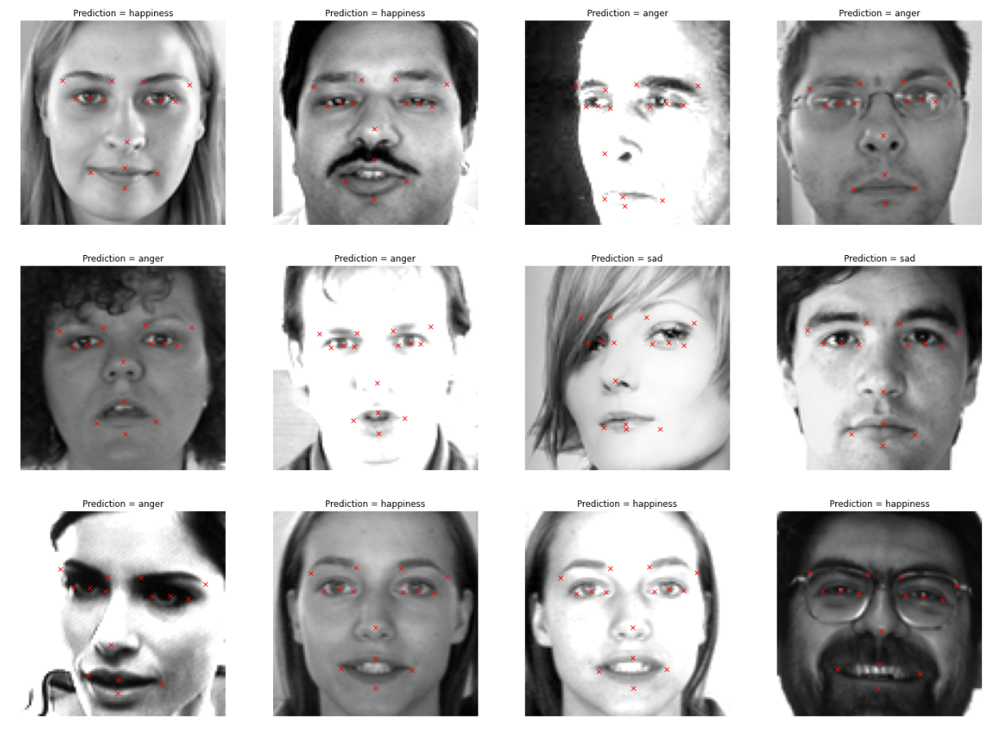

# Facial Detection Models

This is a project to train two models (1st model is to detect key points on the human face, 2nd model is to classify the emotion of the human in the picture) and then combin them together for deployment for future use.

